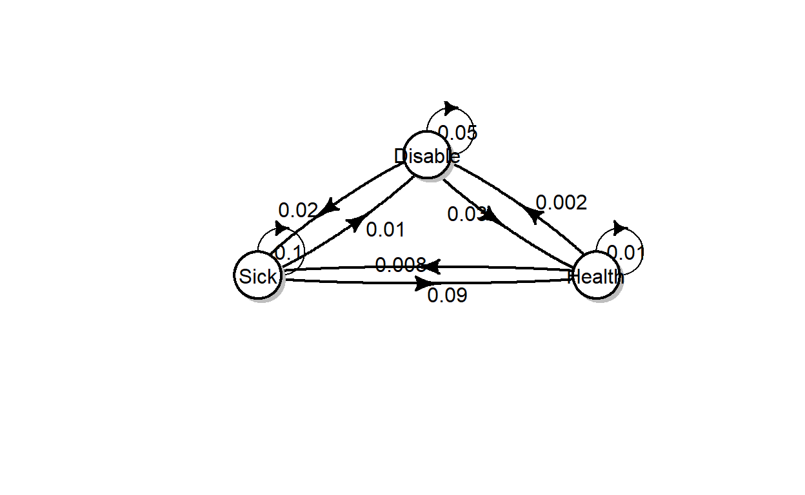
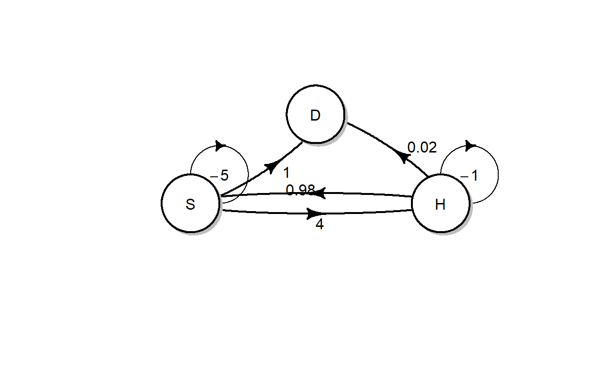

## Introduction
  
In this tutorial we aim to discuss the application of continuous time Markov chains (MC) in `R` by using the package **markovchain** [@Spedicato2017].

This tutorial will consist of three parts: Markov chain objects in `R`, properties of a continuous Markov chain, and simulation and parameter estimation of a Markov chain.

Note that the **markovchain** and **diagram** [@Soetaert2017] packages (the latter is only used to create transition diagrams) have been loaded in the current `R` workspace. Therefore you can utilise the capacities of these packages without explicitly loading it. Furthermore, we focus on the continuous time Markov chains in this tutorial, although the package also covers functions for discrete time Markov chains.

However, if you are using the packages outside this tutorial remember to first install the packages with the code:


```r
install.packages("markovchain", dependencies = TRUE)
install.packages("diagram", dependencies = TRUE)
```

And then load them with the instruction


```r
library("markovchain")
library("diagram")
```


## Markov chain objects in `R`


### Create a MC object in `R`

Here we use a simple two-state Markov chain that models the health states of an individual. In order to specify a MC object in `R`, one needs to specify the transition matrix (also called the generator) of the MC.

In the following example, we create a matrix object called `health_tran` as the transition matrix. Note that we also specify the names of the cells for this matrix.


```r
health_states <- c("H", "S") # names of states

health_states
```

```
## [1] "H" "S"
```

```r
# note that dimension names are specified
health_tran<- matrix(data = c(-1, 1,10, -10), nrow = 2,
              byrow = TRUE, dimnames = list(health_states, health_states))

health_tran
```

```
##    H   S
## H -1   1
## S 10 -10
```

Now we will create a MC based on the transition matrix we specify.


```r
health_mc <- new("ctmc", states = health_states, 
                 byrow = TRUE, generator = health_tran, 
                 name = "Health-Sickness MC")

health_mc
```

```
## An object of class "ctmc"
## Slot "states":
## [1] "H" "S"
## 
## Slot "byrow":
## [1] TRUE
## 
## Slot "generator":
##    H   S
## H -1   1
## S 10 -10
## 
## Slot "name":
## [1] "Health-Sickness MC"
```

### Present the transition diagram given a MC

One can visualise the transitions of a MC by using the `plot` function. Here we use a three-state MC as an example. 


```r
disable_states <- c("Health", "Sick", "Disable") # names of states

disable_tran<- matrix(data = c(
  -0.01, 0.008, 0.002,
  0.09, -0.1, 0.01,
  0.03, 0.02, -0.05), 
  nrow = 3, byrow = TRUE, dimnames = list(disable_states, disable_states))

disable_mc <- new("ctmc", states = disable_states, 
                 byrow = TRUE, generator = disable_tran, 
                 name = "Disability MC")

plot(disable_mc, package="diagram", box.size = 0.06)
```




### Exercises

Suppose that you are given the following transition diagram for the change of an individual's heath status (Heath, Sickness or Death). 



1.  Create a MC object that corresponds to the transition diagram.

<div class="tutorial-exercise" data-label="mcintro" data-caption="Code" data-completion="1" data-diagnostics="1" data-startover="1" data-lines="22">

```text
# states
example_states <- c("H", "S", "D")

# transition matrix
example_marix<- 
  
# display the matrix
example_marix

# create the MC

# display the transition diagram
```

<script type="application/json" data-opts-chunk="1">{"fig.width":6.5,"fig.height":4,"fig.retina":2,"fig.align":"default","fig.keep":"high","fig.show":"asis","out.width":624,"warning":true,"error":false,"message":true,"exercise.df_print":"paged","exercise.timelimit":60,"exercise.checker":"NULL"}</script></div>

<div class="tutorial-exercise-support" data-label="mcintro-solution" data-caption="Code" data-completion="1" data-diagnostics="1" data-startover="1" data-lines="0">

```text
# states
example_states <- c("H", "S", "D")

# transition matrix
example_marix<- matrix(data = c(
  -1, 0.98, 0.02,
  4, -5, 1,
  0,0,0), 
  nrow = 3, byrow = TRUE, dimnames = list(example_states, example_states))

# display the matrix
example_marix

# create the MC
example_mc <- new("ctmc", states = example_states, 
                 byrow = TRUE, generator = example_marix, 
                 name = "Heath-Sickness-Death")

# display the transition diagram
plot(example_mc, package="diagram",box.size = 0.1)
```

</div>

2. 

<!--html_preserve--><div class="panel panel-default">
<div data-label="mcintro2" class="tutorial-question panel-body">
<div id="mcintro2-answer_container" class="shiny-html-output"></div>
<div id="mcintro2-message_container" class="shiny-html-output"></div>
<div id="mcintro2-action_button_container" class="shiny-html-output"></div>
<script>if (Tutorial.triggerMathJax) Tutorial.triggerMathJax()</script>
</div>
</div><!--/html_preserve-->

## Properties of a Markov chain

### Calculate the limiting probabilities of a MC

One important calculation of a MC is the evaluation of the limiting probabilities. In `R`, one can calculate the limiting probabilities by using the `steadyStates` function.


```r
steadyStates(health_mc)
```

```
##              H          S
## [1,] 0.9090909 0.09090909
```

### Obtain the transition probability matrix of the embedded MC

Given a continuous time MC, there exists an embedded MC (which is a discrete time MC by definition). One can use the `generatorToTransitionMatrix` to calculate the transition probability matrix of the embedded MC.

Note that the `generatorToTransitionMatrix` applies to the generator of a MC, instead the MC object itself.

With the previous example of the two-state MC, the transition probability matrix of the embedded MC is simply a diagonal matrix.


```r
health_tran # generator
```

```
##    H   S
## H -1   1
## S 10 -10
```

```r
generatorToTransitionMatrix(health_tran) # embedded MC
```

```
##   H S
## H 0 1
## S 1 0
```

With the example of the three-state MC, the embedded MC is slightly more complex.


```r
disable_tran # generator
```

```
##         Health   Sick Disable
## Health   -0.01  0.008   0.002
## Sick      0.09 -0.100   0.010
## Disable   0.03  0.020  -0.050
```

```r
generatorToTransitionMatrix(disable_tran) # embedded MC
```

```
##         Health Sick Disable
## Health     0.0  0.8     0.2
## Sick       0.9  0.0     0.1
## Disable    0.6  0.4     0.0
```

### Check whether a MC is irreducible and/or time reversible

One can check whether a MC is irreducible and/or time reversible.


```r
# Is a MC irreducible?
is.CTMCirreducible(disable_mc)
```

```
## [1] TRUE
```

```r
# Is a MC time reverible?
is.TimeReversible(disable_mc)
```

```
## [1] FALSE
```

### Calculating discrete time probabilities from a MC object

In practice, one may need to evaluate the transition probabilities over discrete time intervals. For example, given the previous three state MC model, one may want to evaluate the probabilities of an individual being disabled at time 1.5, given that he/she is healthy at time 0.

In `R`, one can use the `probabilityatT` function to return a matrix of transition probabilities over a discrete time horizon of 1.5.


```r
probabilityatT(disable_mc,1.5)
```

```
##             Health       Sick     Disable
## Health  0.98594366 0.01110376 0.002952585
## Sick    0.12476142 0.86163944 0.013599143
## Disable 0.04491223 0.02707360 0.928014170
```

and one can read the required probability in the first row and third column.

Alternatively, one can further specify that the initial state is Health, by stating the initial state argument to be 1.


```r
probabilityatT(disable_mc,1,1.5)
```

```
## [1] 0.990426094 0.007594640 0.001979266
```


### Exercises

Suppose that the change of weather patterns of City X follows a continuous time MC with three states: Sunny (S), Cloudy (C), and Rainy (R). The MC object, `weather_states`, has been created as follows. Note the unit of time is day.


```r
weather_states <- c("S", "R", "C")

weather_tran<- matrix(data = c(
  -0.1, 0.08, 0.02,
  0.35, -0.5, 0.15,
  0.2,0.2,-0.4), 
  nrow = 3, byrow = TRUE, dimnames = list(weather_states, weather_states))

weather_mc <- new("ctmc", states = weather_states, 
                 byrow = TRUE, generator = weather_tran, 
                 name = "Sunny-Cloudy-Rainy")
```

1. In the long run, what is the proportion of time where the weather in City X is sunny?


<div class="tutorial-exercise-support" data-label="weatherSetup" data-caption="Code" data-completion="1" data-diagnostics="1" data-startover="1" data-lines="0">

```text
weather_states <- c("S", "R", "C")

weather_tran<- matrix(data = c(
  -0.1, 0.08, 0.02,
  0.35, -0.5, 0.15,
  0.2,0.2,-0.4), 
  nrow = 3, byrow = TRUE, dimnames = list(weather_states, weather_states))

weather_mc <- new("ctmc", states = weather_states, 
                 byrow = TRUE, generator = weather_tran, 
                 name = "Sunny-Cloudy-Rainy")
```

</div>


<div class="tutorial-exercise" data-label="mcprop" data-caption="Code" data-completion="1" data-diagnostics="1" data-startover="1" data-lines="2"><script type="application/json" data-opts-chunk="1">{"fig.width":6.5,"fig.height":4,"fig.retina":2,"fig.align":"default","fig.keep":"high","fig.show":"asis","out.width":624,"warning":true,"error":false,"message":true,"exercise.df_print":"paged","exercise.timelimit":60,"exercise.setup":"weatherSetup","exercise.checker":"NULL"}</script></div>

<div class="tutorial-exercise-support" data-label="mcprop-solution" data-caption="Code" data-completion="1" data-diagnostics="1" data-startover="1" data-lines="0">

```text
steadyStates(weather_mc)
```

</div>

2. 

Given that the following `R` codes and results, answer the multiple choice question at the end.


```r
probabilityatT(weather_mc,3)
```

```
##           S         R          C
## S 0.8268973 0.1198460 0.05325675
## R 0.5467253 0.3100969 0.14317776
## C 0.4429703 0.2028500 0.35417970
```

<!--html_preserve--><div class="panel panel-default">
<div data-label="mcprop2" class="tutorial-question panel-body">
<div id="mcprop2-answer_container" class="shiny-html-output"></div>
<div id="mcprop2-message_container" class="shiny-html-output"></div>
<div id="mcprop2-action_button_container" class="shiny-html-output"></div>
<script>if (Tutorial.triggerMathJax) Tutorial.triggerMathJax()</script>
</div>
</div><!--/html_preserve-->

## Simulation and parameter estimation of a Markov chain

### Simulate MC transitions

The `rctmc` function allows one to simulate MC transitions. Now let's use the two-state Health-Sick model, and the following `R` codes will simulate the transition from time 0 to 20. Here one needs to state the MC object in the `ctmc` argument, and also provide the length of time in the `T` argument. While the `T` argument is used, one needs to set `n` to be `Inf`. Here, `n` represents the number of samples to generate.


```r
rctmc(n = Inf, ctmc = health_mc, T = 20)
```

```
## [[1]]
##  [1] "H" "S" "H" "S" "H" "S" "H" "S" "H" "S" "H" "S" "H" "S" "H" "S" "H" "S" "H"
## [20] "S" "H" "S" "H" "S" "H" "S" "H" "S" "H" "S" "H" "S" "H" "S" "H" "S" "H"
## 
## [[2]]
##  [1]  0.000000  3.936126  4.173707  4.250070  4.274359  4.550181  4.596363
##  [8]  4.829685  4.923047  5.251101  5.266944  6.110717  6.147849  8.180369
## [15]  8.339726  9.163754  9.262072  9.870807  9.890816 10.505170 10.505796
## [22] 11.845990 11.896268 12.027802 12.107544 12.690841 12.722521 16.230769
## [29] 16.399247 16.846369 16.913136 17.757076 17.794000 18.800676 19.034520
## [36] 19.382532 19.404287
```

Alternatively, one can specify the number of transitions (that is, `n`). In this case, `T` is no longer required. Furthermore, one can also provide the distribution of the initial states.


```r
rctmc(n = 5, ctmc = health_mc, initDist = c(0.2, 0.8), include.T0 = FALSE)
```

```
## [[1]]
## [1] "S" "H" "S" "H" "S"
## 
## [[2]]
## [1] 1.348920 1.377110 4.622789 4.690170 5.155199
```

```r
rctmc(n = 5, ctmc = health_mc, initDist = c(0.2, 0.8), include.T0 = TRUE)
```

```
## [[1]]
## [1] "S" "H" "S" "H" "S" "H"
## 
## [[2]]
## [1] 0.0000000 0.1366525 1.9290084 2.1554103 2.4576143 2.4744877
```

If we choose `include.T0 = FALSE`, then the output will start from the first transition (e.g. if the first state is S, then it means at that time there is a transition from H to S); if `include.T0 = TRUE` is used, then the output will start from time 0 (that is, the output will show the first state at time 0).

One can plot the simulated MC chain by using the `plot` function. Given that the states are not numerical, one needs to specify numerical values on the y-axis corresponding to the states. In the following example, we plot H and S states at 2 and 1.


```r
health_simu <- rctmc(n = 100, ctmc = health_mc, initDist = c(0.2, 0.8), include.T0 = TRUE)

health_y <- (health_simu[[1]]=="H")*2 + (health_simu[[1]]=="S")*1

plot(health_simu[[2]], health_y, xlab="time of transition", ylab="States", yaxt="n")

axis(2, at=c(1,2), labels=c("S","H"))
```


### Parameter estimation of a MC

One can use the `ctmcFit` function to estimate the parameters of a MC. In the following example, we estimate the parameters of the two-state MC given the simulated path we just created.


```r
health_fit<-ctmcFit(health_simu)

health_fit$estimate
```

```
## An object of class "ctmc"
## Slot "states":
## [1] "H" "S"
## 
## Slot "byrow":
## [1] TRUE
## 
## Slot "generator":
##           H         S
## H -1.064430  1.064430
## S  8.883122 -8.883122
## 
## Slot "name":
## [1] ""
```

Note that the data that is provided for the `ctmcFit` should include the initial time 0. In the above example, we specify `include.T0 = TRUE`, therefore this condition is satisfied for this simulated dataset.

### Exercise

Use the `disable_mc` MC object. Simulate the transitions of health-sickness-disability for 100 days. You should use the limiting probabilities as the initial distribution. 


<div class="tutorial-exercise-support" data-label="mcsimuSetup" data-caption="Code" data-completion="1" data-diagnostics="1" data-startover="1" data-lines="0">

```text
disable_states <- c("Health", "Sick", "Disable") # names of states

disable_tran<- matrix(data = c(
  -0.01, 0.008, 0.002,
  0.09, -0.1, 0.01,
  0.03, 0.02, -0.05), 
  nrow = 3, byrow = TRUE, dimnames = list(disable_states, disable_states))

disable_mc <- new("ctmc", states = disable_states, 
                 byrow = TRUE, generator = disable_tran, 
                 name = "Disability MC")
```

</div>


<div class="tutorial-exercise" data-label="mcsimu" data-caption="Code" data-completion="1" data-diagnostics="1" data-startover="1" data-lines="10">

```text
# calculate the limiting probabilities


# simulate the MC for 100 days


# display the results
```

<script type="application/json" data-opts-chunk="1">{"fig.width":6.5,"fig.height":4,"fig.retina":2,"fig.align":"default","fig.keep":"high","fig.show":"asis","out.width":624,"warning":true,"error":false,"message":true,"exercise.df_print":"paged","exercise.timelimit":60,"exercise.setup":"mcsimuSetup","exercise.checker":"NULL"}</script></div>

<div class="tutorial-exercise-support" data-label="mcsimu-solution" data-caption="Code" data-completion="1" data-diagnostics="1" data-startover="1" data-lines="0">

```text
# calculate the limiting probabilities
disable_limit<-steadyStates(disable_mc)

# simulate the MC for 3000 days
simu<-rctmc(n = Inf, ctmc = disable_mc, initDist = disable_limit, T=100, include.T0 = TRUE)

# display the results
simu
```

</div>
Note that if you run your code multiple time you will get every time a new realisation of the Markov chain


<!-- 2. Now we perform the above simulation for up to 10000 days, and the result is stored at a variable called `simu2`. The parameter estimation is performed as follows. -->

<!-- ```{r} -->
<!-- # calculate the limiting probabilities -->
<!-- disable_limit<-steadyStates(disable_mc) -->

<!-- # simulate the MC for 3000 days -->
<!-- simu2<-rctmc(n = Inf, ctmc = disable_mc, initDist = disable_limit, T=10000, include.T0 = TRUE) -->

<!-- # estimate the parameters -->
<!-- simu2_fit<-ctmcFit(simu2) -->

<!-- # display the results -->
<!-- simu2_fit -->
<!-- ``` -->

<!-- ```{r mcest, echo=FALSE} -->
<!-- question("Which one of the following information is not provided in the outpus?", -->
<!--   answer("The lower bound of the confidence interval of the estiamted transition rates.", correct = TRUE), -->
<!--   answer("The upper bound of the confidence interval of the estiamted transition rates out of each state.", message = "Incorrect. This is provided as `$errors$lambdaConfidenceInterval$upperEndpointVector`"), -->
<!--   answer("The estimated parameters of the generator.",message = "Incorrect. This is provided as `$estimate`"), -->
<!--   allow_retry = TRUE -->
<!-- ) -->
<!-- ``` -->

## References
<!--html_preserve-->
<script type="application/shiny-prerendered" data-context="server-start">
library(learnr)
library("markovchain")
library("diagram")
tutorial_options(exercise.timelimit = 60)
knitr::opts_knit$set(root.dir = getwd()) 
</script>
<!--/html_preserve-->
<!--html_preserve-->
<script type="application/shiny-prerendered" data-context="server">
learnr:::register_http_handlers(session, metadata = NULL)
</script>
<!--/html_preserve-->
<!--html_preserve-->
<script type="application/shiny-prerendered" data-context="server">
`tutorial-exercise-mcintro-result` <- learnr:::setup_exercise_handler(reactive(req(input$`tutorial-exercise-mcintro-code-editor`)), session)
output$`tutorial-exercise-mcintro-output` <- renderUI({
  `tutorial-exercise-mcintro-result`()
})
</script>
<!--/html_preserve-->
<!--html_preserve-->
<script type="application/shiny-prerendered" data-context="server">
learnr:::question_prerendered_chunk(structure(list(type = "learnr_radio", label = "mcintro2", question = structure("Which one of the three states is an absorbing state?", html = TRUE, class = c("html", "character")), answers = list(structure(list(id = "lnr_ans_efe51e9",     option = "Death", value = "Death", label = structure("Death", html = TRUE, class = c("html",     "character")), correct = TRUE, message = NULL), class = c("tutorial_question_answer", "tutorial_quiz_answer")), structure(list(id = "lnr_ans_3606b82",     option = "Sickness", value = "Sickness", label = structure("Sickness", html = TRUE, class = c("html",     "character")), correct = FALSE, message = structure("Incorrect. One can move from S to H or D, hence S is not absorbing.", html = TRUE, class = c("html",     "character"))), class = c("tutorial_question_answer", "tutorial_quiz_answer")), structure(list(id = "lnr_ans_1028b6f", option = "Health",     value = "Health", label = structure("Health", html = TRUE, class = c("html",     "character")), correct = FALSE, message = structure("Incorret. One can move from H to S or D, hence H is not absorbing.", html = TRUE, class = c("html",     "character"))), class = c("tutorial_question_answer", "tutorial_quiz_answer")), structure(list(id = "lnr_ans_2accc3d", option = "There is no absorbing state.",     value = "There is no absorbing state.", label = structure("There is no absorbing state.", html = TRUE, class = c("html",     "character")), correct = FALSE, message = structure("Incorret. D is an absorbing state since the transition rate from D to any other state is 0.", html = TRUE, class = c("html",     "character"))), class = c("tutorial_question_answer", "tutorial_quiz_answer"))), button_labels = list(submit = structure("Submit Answer", html = TRUE, class = c("html", "character")), try_again = structure("Try Again", html = TRUE, class = c("html", "character"))), messages = list(correct = structure("Correct!", html = TRUE, class = c("html", "character")), try_again = structure("Incorrect", html = TRUE, class = c("html", "character")), incorrect = structure("Incorrect", html = TRUE, class = c("html", "character")), message = NULL, post_message = NULL), ids = list(    answer = "mcintro2-answer", question = "mcintro2"), loading = structure("<strong>Loading:<\u002fstrong> \nWhich one of the three states is an absorbing state?\n<br/><br/><br/>", html = TRUE, class = c("html", "character")), random_answer_order = FALSE, allow_retry = TRUE,     seed = 1991756267.07252, options = list()), class = c("learnr_radio", "tutorial_question")))
</script>
<!--/html_preserve-->
<!--html_preserve-->
<script type="application/shiny-prerendered" data-context="server">
`tutorial-exercise-mcprop-result` <- learnr:::setup_exercise_handler(reactive(req(input$`tutorial-exercise-mcprop-code-editor`)), session)
output$`tutorial-exercise-mcprop-output` <- renderUI({
  `tutorial-exercise-mcprop-result`()
})
</script>
<!--/html_preserve-->
<!--html_preserve-->
<script type="application/shiny-prerendered" data-context="server">
learnr:::question_prerendered_chunk(structure(list(type = "learnr_radio", label = "mcprop2", question = structure("Which one of the following statements is correct?", html = TRUE, class = c("html", "character")), answers = list(structure(list(id = "lnr_ans_f2c993e",     option = "Given that the weather is sunny right now, the probability that it will be sunny for 3 days is 82.68973%",     value = "Given that the weather is sunny right now, the probability that it will be sunny for 3 days is 82.68973%",     label = structure("Given that the weather is sunny right now, the probability that it will be sunny for 3 days is 82.68973%", html = TRUE, class = c("html",     "character")), correct = FALSE, message = structure("0.8268973 is the probability that the weather will be sunny at exactly day 3 (which includes the events that the weather can experience multiple transitions within the 3 days).", html = TRUE, class = c("html",     "character"))), class = c("tutorial_question_answer", "tutorial_quiz_answer")), structure(list(id = "lnr_ans_f866561", option = "If the weather is rainy right now, then there is a 31.00969% chance that it will be Rainy in 1 day.",     value = "If the weather is rainy right now, then there is a 31.00969% chance that it will be Rainy in 1 day.",     label = structure("If the weather is rainy right now, then there is a 31.00969% chance that it will be Rainy in 1 day.", html = TRUE, class = c("html",     "character")), correct = FALSE, message = structure("The R codes only compute the probabilities for a 3-day horizon.", html = TRUE, class = c("html",     "character"))), class = c("tutorial_question_answer", "tutorial_quiz_answer")), structure(list(id = "lnr_ans_4a4c6cc", option = "If the weather is cloudy, then it is most likely that the weather will be Sunny in 3 days.",     value = "If the weather is cloudy, then it is most likely that the weather will be Sunny in 3 days.",     label = structure("If the weather is cloudy, then it is most likely that the weather will be Sunny in 3 days.", html = TRUE, class = c("html",     "character")), correct = TRUE, message = NULL), class = c("tutorial_question_answer", "tutorial_quiz_answer"))), button_labels = list(submit = structure("Submit Answer", html = TRUE, class = c("html", "character")), try_again = structure("Try Again", html = TRUE, class = c("html", "character"))), messages = list(correct = structure("Correct!", html = TRUE, class = c("html", "character")), try_again = structure("Incorrect", html = TRUE, class = c("html", "character")), incorrect = structure("Incorrect", html = TRUE, class = c("html", "character")), message = NULL, post_message = NULL), ids = list(    answer = "mcprop2-answer", question = "mcprop2"), loading = structure("<strong>Loading:<\u002fstrong> \nWhich one of the following statements is correct?\n<br/><br/><br/>", html = TRUE, class = c("html", "character")), random_answer_order = FALSE, allow_retry = TRUE,     seed = 100841422.453042, options = list()), class = c("learnr_radio", "tutorial_question")))
</script>
<!--/html_preserve-->
<!--html_preserve-->
<script type="application/shiny-prerendered" data-context="server">
`tutorial-exercise-mcsimu-result` <- learnr:::setup_exercise_handler(reactive(req(input$`tutorial-exercise-mcsimu-code-editor`)), session)
output$`tutorial-exercise-mcsimu-output` <- renderUI({
  `tutorial-exercise-mcsimu-result`()
})
</script>
<!--/html_preserve-->
