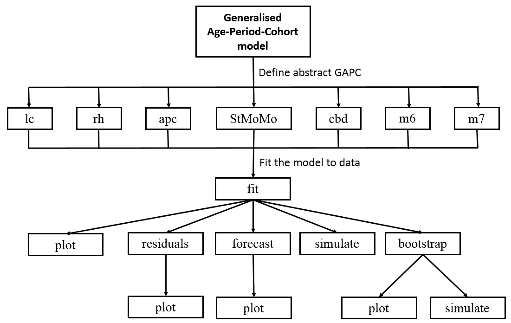

```{r setup, include=FALSE}
library("learnr")
library("StMoMo")
tutorial_options(exercise.timelimit = 60)
knitr::opts_knit$set(root.dir = getwd()) 
```


## Introduction

In this tutorial we aim to illustrate the practical implementation of stochastic mortality models  in `R` using the package **StMoMo**. This tutorial will focus on the modelling of mortality rates for males in England and Wales, but the techniques shown can be easily extended to other countries.

**StMoMo** [@Villegas2018] is a package implementing  stochastic mortality models belonging to the class of Generalised Age-Period-Cohort model and provides tools for fitting stochastic mortality models, assessing their goodness of fit and performing mortality projections. Note that this package has been loaded in the current `R` workspace. Therefore you can utilise the capacities of the package without explicitly loading it.

However, if you are using this package outside this tutorial remember to first install the package with the code:

```{r eval=FALSE}
install.packages("StMoMo", dependencies = TRUE)
```

And then load it with the instruction

```{r eval=FALSE}
library("StMoMo")
```


<!-- An overview of the structure of **StMoMo** and of the  functions it has available is provided by the diagram below -->


<!--  -->


## Data for England and Wales

The object `EWMaleData` included in the package **StMoMo** contains data on deaths and central exposures for England and Wales males for the period 1961-2011 and for ages 0-100 obtained from the Human Mortality Database (http://www.mortality.org/): 

```{r showEWdata, eval=TRUE, cache=TRUE}
EWMaleData
```


We can  do a plot of the evolution mortality at some sample ages with the following code:

```{r}
mxt <- EWMaleData$Dxt /EWMaleData$ Ext
xplot <- c("30", "40", "50", "60", "70", "80")
matplot(EWMaleData$years, t(mxt[xplot,]),  type = "l", log = "y", lty = 1, ylab = "mxt") 
text(1963, mxt[xplot, "1985"], labels = xplot)
```

From this graph we see that mortality in England and Wales has improved considerably over the past 50 years. We can get a quick quantification of this mortality improvement as follows:

```{r}
#Reduction factors
rx <- (mxt[, "2011"]/mxt[, "1961"])^(1/(2011-1961))
#Compute Improvement rates and smooth
ix <- 1 - rx
ix_smooth <- fitted(smooth.spline(EWMaleData$ages, ix))
#Plot results
plot(EWMaleData$ages, ix, type = "l", main = "Improvement rates in EW 1961-2011")
lines(EWMaleData$ages, ix_smooth, col = "blue", lwd = 2)
```

### Exercise
Calculate and present the mortality improvement rates in EW from 1990 to 2011 for the ages 20, 40, 60, 80, and 100.


```{r improv, exercise=TRUE,exercise.lines=12}
# import the data 
mxt <- EWMaleData$Dxt /EWMaleData$ Ext
xplot <- c("20", "40", "60", "80", "100")

# reduction factors
rx <- (mxt[, "2011"]/mxt[, "1990"])^(1/(2011-1990))

# compute Improvement rates
ix <- 1 - rx

# plot results
plot(EWMaleData$ages, ix, type = "l", main = "Improvement rates in EW 1990-2011")
```

```{r improv-solution}
# import the data 
mxt <- EWMaleData$Dxt /EWMaleData$ Ext
xplot <- c("20", "40", "60", "80", "100")

# reduction factors
rx <- (mxt[, "2011"]/mxt[, "1990"])^(1/(2011-1990))

# compute Improvement rates
ix <- 1 - rx

# plot results
plot(EWMaleData$ages, ix, type = "l", main = "Improvement rates in EW 1990-2010")
```


```{r improv2, echo=FALSE}
question("Based on the results, which one of the following statements is correct?",
  answer("The mortality improvement is the highest around age 40.",message = "Incorret. The improvement rate is the lowest around age 40."),
  answer("The mortatlity improvement rate is constant across all ages.",message = "Incorret. There is more improvement at around age 20 and ages 60-80."),
  answer("The highest improvement appears for ages before 20.",correct = TRUE),
  allow_retry = TRUE
)
```

## Models 

In order to illustrate the creation of stochastic mortality mortality models and other capabilities of **StMoMo**, we will consider the models summarised in the table below 

Model         | Predictor ($\eta_{xt}$)
------------- | -------------------------------------------------
LC            | $\alpha_x + \beta^{(1)}_x \kappa^{(1)}_t$
CBD           | $\kappa_t^{(1)} + (x-\bar{x})\kappa_t^{(2)}$
APC           | $\alpha_x + \kappa^{(1)}_t+ \gamma_{t-x}$
M7            | $\kappa_t^{(1)} + (x-\bar{x})\kappa_t^{(2)} + \left((x-\bar{x})^2-\hat{\sigma}_x^2\right)\kappa_t^{(3)} + \gamma_{t-x}$


In this table, LC stands for the Lee-Carter model; CBD for the Cairns-Blake-Dowd model; APC for the classical Age-Period-Cohort model; and M7 for the quadratic CBD with cohort effects. 

For consistency, we will consider all the models under a log-Poisson setting (however, in **StMoMo** we could easily use a logit-binomial setting focusing on one-year death probabilities).

$$D_{xt}\sim \mathrm{Poisson}(E^c_{xt}\mu_{xt})$$
$$\log \mu_{xt}=\eta_{xt}$$

**StMoMo** has predefined functions for defining these four stochastic mortality. We can thus create these models with the following commands:


```{r}
LC <- lc()
CBD <- cbd(link = "log")
APC <- apc()
M7 <- m7(link = "log")
```  

Each of the objects will have an abstract representation of the corresponding stochastic mortality model:
```{r}
LC 
CBD
APC
M7 
```  

**Exercise** 

```{r parastate, echo=FALSE}
question("Among the four models, which ones incorporate a cohort effect?",
  answer("LC and APC",message = "Cohort effects apply to people with the same birth age, hence should be reflected with a subscript (t-x) in the model specification. APC has a cohort effect but LC doesn't"),
  answer("CBD and M7",message = "Cohort effects apply to people with the same birth age, hence should be reflected with a subscript (t-x) in the model specification. M7 has a cohort effect but CBD doesn't"),
   answer("LC and CBD",message = "Cohort effects apply to people with the same birth age, hence should be reflected with a subscript (t-x) in the model specification. LC nor CBD have a cohort effect"), 
  answer("APC and M7",correct = TRUE),
  allow_retry = TRUE
)
```


## Model fitting

In **StMoMo** the fitting of stochastic mortality models to data is carried out with the function `fit`.

In our examples, we will concentrate on ages 55 to 89 as
the CBD model and the M7 model have been particularly designed to fit higher ages.  Models LC, APC, CBD and  M7 can be fitted to England and Wales male mortality
data for ages 55 to 89 using the code:

```{r, results="hide"}
#Ages for fitting
ages.fit <- 55:89
#Fit models         
LCfit <- fit(LC, data = EWMaleData, ages.fit = ages.fit)
APCfit <- fit(APC, data = EWMaleData, ages.fit = ages.fit)
CBDfit <- fit(CBD, data = EWMaleData, ages.fit = ages.fit)
M7fit <- fit(M7, data = EWMaleData, ages.fit = ages.fit)
```

We can then plot the parameter estimates as follows:
```{r}
 plot(LCfit)
```

```{r}
 plot(CBDfit, parametricbx = FALSE)
```

```{r}
 plot(M7fit, parametricbx = FALSE)
```


### Exercise

Present the parameter estimates of the APC model.

```{r estmSetup, include=FALSE}
APC <- apc()
ages.fit <- 55:89
APCfit <- fit(APC, data = EWMaleData, ages.fit = ages.fit)
```


```{r estm, exercise=TRUE,exercise.lines=2, exercise.setup = "estmSetup"}

```

```{r estm-solution}
plot(APCfit, parametricbx = FALSE)
```

**Exercise** 

```{r estm2, echo=FALSE}
question("Based on the results of the APC fitting, which one of the following statements is correct?",
  answer("An increasing level of $\\alpha_x$ implies mortality improvement over time.",message = "$\\alpha_x$ refers to age specific mortality rate, hence is not related to mortality improvement over time."),
  answer("A decreasing level of $\\kappa_t$ means the mortality rate increases over time.",message = "A lower level of $$\\kappa_t$$ means a lower level of mortality rate"),
  answer("A decreasing level of $\\kappa_t$ means older people have higher mortality rates.",message = "$\\kappa_t$ describes the overall mortality improvement over time, and is independent of age."),  
  answer("People who were born between 1920-1940 experienced higher mortality improvement compared to those born between 1900-1920.",correct = TRUE),
  allow_retry = TRUE
)
```


## Goodness-of-fit - residuals analysis

The goodness-of-fit of the mortality models can be analysed by inspecting the residuals
of the fitted models. In **StMoMo**, these residuals can be computed with the function `residuals`:

```{r}
LCres <- residuals(LCfit)
CBDres <- residuals(CBDfit)
APCres <- residuals(APCfit)
M7res <- residuals(M7fit)
```

Graphs of these residuals can be produced using the generic function `plot`. For instance, heat maps of the residuals can be produced with the commands (Sign plots can also be produce if we set `type = "signplot"`): 

```{r}
plot(LCres, type = "colourmap", reslim = c(-3.5, 3.5))
plot(CBDres, type = "colourmap", reslim = c(-3.5, 3.5))
plot(APCres, type = "colourmap", reslim = c(-3.5, 3.5))
``` 


Similarly, scatter plots of the residuals can be produced with the commands:
```{r}
plot(CBDres, type = "scatter", reslim = c(-3.5,3.5))

``` 

**Exercise** Present the heat map and scatter plots of residuals for the M7 model.

```{r gofSetup, include=FALSE}
M7 <- m7(link = "log")
ages.fit <- 55:89
M7fit <- fit(M7, data = EWMaleData, ages.fit = ages.fit)
M7res <- residuals(M7fit)
```


```{r gof, exercise=TRUE,exercise.lines=6, exercise.setup = "gofSetup"}
# heat map


# scatter plot

```

```{r gof-solution}
# heat map
plot(M7res, type = "colourmap", reslim = c(-3.5, 3.5))

# scatter plot
plot(M7res, type = "scatter", reslim = c(-3.5,3.5))
```

**Exercise** 

```{r gof2, echo=FALSE}
question("Based on the results of this section, which one of the following statements is correct?",
  answer("The heat map of the LC model does not show any cohort effect.",message = "There are clear diagonal patterns in  the heat map. This is expected since the LC model does not incorporate cohort effects."),
  answer("The heat map of the M7 model shows better fitting than that of the APC model.",correct = TRUE),
  answer("The scatter plots of the CBD model imply that the fitting is ideal for all ages.",message = "The residuals of the middle ages are much higher than those of younger and elder ages. Hence the fitting is not good enough across different ages."),  
  allow_retry = TRUE
) 
```

## Forecasting and simulation


### Forecasting 

Once we have fitted the stochastic mortality model, we can project it forward to obtain forecast of mortality rates. In **StMoMo** this is accomplished with the function `forecast`. This function assumes that the period indexes follow a multivariate random walk with drift:

$$\boldsymbol{\kappa}_t = \boldsymbol{\delta} + \boldsymbol{\kappa}_{t-1} + \boldsymbol{\xi}_t^\kappa, \qquad \boldsymbol{\kappa}_t = 
\left(\!
    \begin{array}{c}
      \kappa_t^{(1)} \\
      \vdots\\
  		\kappa_t^{(N)}
    \end{array}
  \!\right), \qquad \boldsymbol{\xi}_t^\kappa\sim N(\mathbf{0},\Sigma),$$


and that the cohort effects can be modelled with an  ARIMA$(p,q,d)$ with drift: 

$$\Delta^d\gamma_c =  \delta_0 + \phi_1\Delta^d\gamma_{c-1} +\cdots+ \phi_p\Delta^d\gamma_{c-p}+\epsilon_{c}+\delta_1\epsilon_{c-1}+\cdots+\delta_q\epsilon_{c-q}$$

50-year ahead ($h = 50$) central projections of the
period indexes, cohort index, and mortality rates for the England and Wales
mortality experience using the LC, CBD and APC model can be obtained with the code:

```{r}
LCfor <- forecast(LCfit, h=50)
CBDfor <- forecast(CBDfit, h=50)
APCfor <- forecast(APCfit, h=50, gc.order = c(1,1,0))
``` 

Note that here we have a assumed for the APC model that the cohort effect,$\gamma_{t-x}$, follows ARIMA$(1,1,0)$ with drift

We can then produce plots of the forecast of the period and cohort indexes with function `plot`:

```{r}
plot(LCfor, only.kt = TRUE)
``` 


```{r}
plot(CBDfor, parametricbx = FALSE)
``` 

```{r}
plot(APCfor, parametricbx = FALSE)
``` 


The projected values of the mortality rates will be in the attribute `$rates` of each of the forecasted models. Then, for instance, the mortality rate at age 65 in year 2030 produced by each of the models can be accessed as follows:

```{r}
LCfor$rates["65", "2030"]
CBDfor$rates["65", "2030"]
APCfor$rates["65", "2030"]
``` 

We can use these to produce a graph of the projected mortality rates. For example, projected rates from the APC model at sample ages can be produced as follows:

```{r}
xplot <- c("60", "70", "80")
matplot(EWMaleData$years, t(mxt[xplot,]), type = "l", log = "y", lty = 1, 
         main = "EW Projected rates from APC", ylab = "mxt",
        xlim = c(1960, 2060), ylim = c(0.001, 0.2)) 
matlines(APCfor$years, t(APCfor$rates[xplot,] ), lty = 2)
text(1963, mxt[xplot, "1985"], labels = xplot)
```

### Simulation

Package **StMoMo** also provides the function `simulate` for simulating trajectories from stochastic mortality models. For example, the code below produces 500 simulated trajectories for the next 50 years of the
four stochastic mortality models fitted previously to the England and Wales male mortality
experience:

```{r}
LCsim <- simulate(LCfit, nsim = 500, h = 50)
CBDsim <- simulate(CBDfit, nsim = 500, h = 50)
APCsim <- simulate(APCfit, nsim = 500, h = 50, gc.order=c(1, 1, 0))
M7sim <- simulate(M7fit, nsim = 500, h = 50, gc.order=c(2, 0, 0))
```

The output from this simulation can be used to extract sample trajectories from a model. For instance, 20 trajectories of the period index of of the LC can be plotted as follows:

```{r}
#Plot period index trajectories for the LC model
plot(LCfit$years, LCfit$kt[1, ], 
     xlim = c(1960, 2061), ylim = c(-65, 15),
     type = "l", xlab = "year", ylab = "kt",
     main = "Period index (LC)")
matlines(LCsim$kt.s$years, LCsim$kt.s$sim[1,,1:20], 
         type = "l", lty = 1)
```

We can also obtain sample trajectories of the force of mortality at age 65 produced by the LC model as follows: 

```{r}

plot(LCfit$years, mxt["65", ], xlim = range(LCfit$years, LCsim$years),
ylim = range(mxt["65", ], LCsim$rates["65", , 1:20]), type = "l",
xlab = "year", ylab = "rate", main = "Mortality rates at age 65")
matlines(LCsim$years, LCsim$rates["65", , 1:20], type = "l", lty = 1)
```

Finally, we can use the output to produce a fanchart depicting the uncertainty in the projection of the mortality at age 65 produced by the LC model: 

```{r}
library(fanplot)
plot(LCfit$years, mxt["65",], xlim = c(1960, 2061), 
     ylim = c(0.0025, 0.05),  pch = 20, log = "y",
     xlab = "year", ylab = "m(65,t) (log scale)")
fan(t(LCsim$rates["65",,]), start = 2012, 
    probs = c(2.5, 10, 25, 50, 75, 90, 97.5), n.fan=4, ln=NULL,
    fan.col = colorRampPalette(c("black", "white")))
```

Note that in the above graph the mortality rates are shown in a log-scale and that the different shades in the projection represent 95%, 80% and 50% prediction intervals.

### Exercise

Forecast the mortality rate of the M7 model over 50 years and print the forecasted mortality rate at age 60 in year 2020. Assume that the cohort indexes of the M7 follow  an  ARIMA$(2,0,0)$ with non-zero intercept

```{r foreSetup, include=FALSE}
M7 <- m7(link = "log")
ages.fit <- 55:89
M7fit <- fit(M7, data = EWMaleData, ages.fit = ages.fit)
M7res <- residuals(M7fit)
```


```{r fore, exercise=TRUE,exercise.lines=9, exercise.setup = "foreSetup"}
# forecast


# plot the forecast


# print the required rate

```

```{r fore-solution}
# forecast
M7for <- forecast(M7fit, h=50, gc.order = c(2,0,0))

# plot the forecast
plot(M7for, parametricbx = FALSE)

# print the required rate
M7for$rates["60", "2020"]
```


## Reference